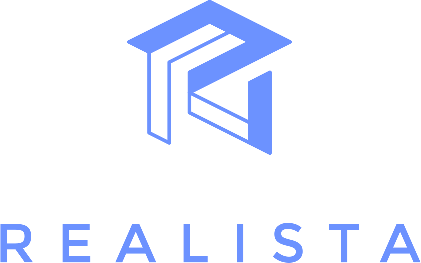
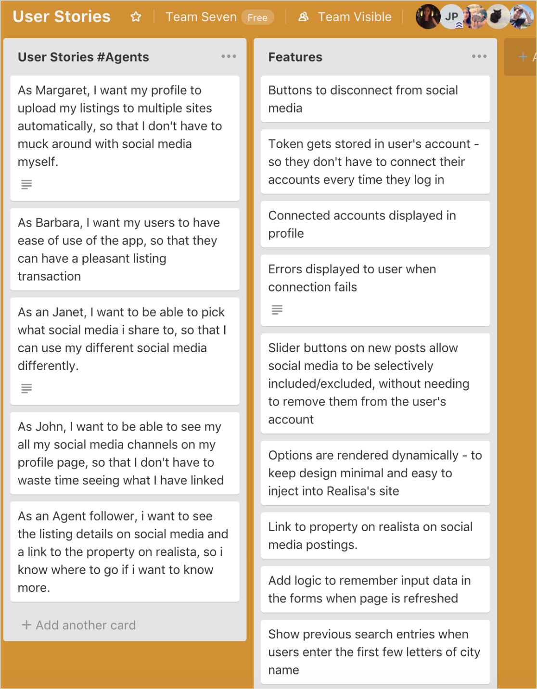
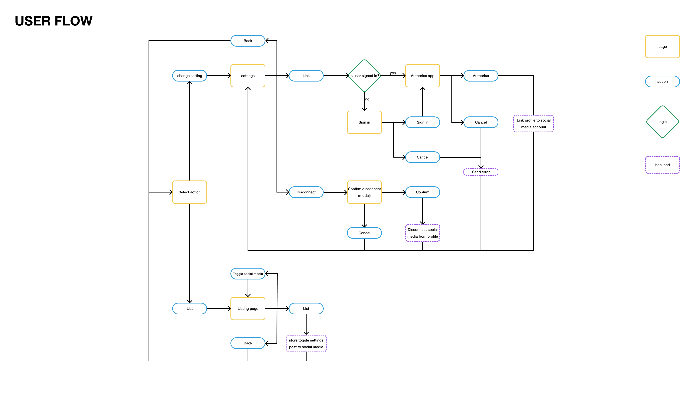
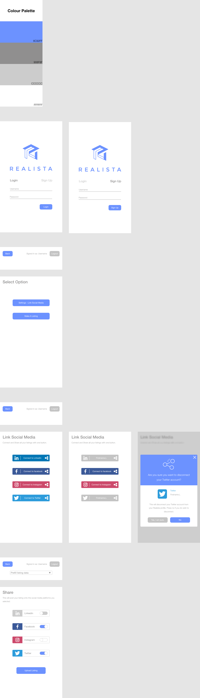
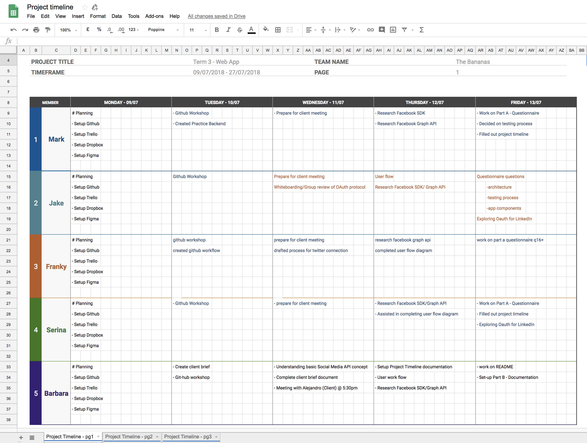

# Part A - Questionnaire

**1. Who is your client?**



Our client is Realista. Realista is a startup which has been in the industry for two years. They are a Melbourne based real estate platform enabling buyers, sellers, renters, and agents to connect through property listings. They help buyers and renters find property quickly, agents list properties easily and leverage their personal network and brand - all in one place.

**2. What is your client’s need (i.e. challenge) that you will be addressing in your project?**

Realista is seeking to improve their brand awareness through word of mouth and social media exposure, and accelerate the growth of their platform.

By providing a service that allows the automation of sharing listings to an agent’s connected social media channels will generate additional exposure of the Realista brand, increase faith and loyalty in the brand, and drive signups for new agents and potential buyers and sellers.

We strive to design, build, test and deploy a microservice web application prototype in order to assist Realista’s business objectives.

**3. Describe the client’s current setup and data.**

Frontend

- HTML
- CSS
- JavaScript
- Bootstrap
- jQuery
- Slick

Backend

- PHP (Laravel)
- MySQL (Database)

**4. Describe the project will you be conducting and how your App will address the client’s needs.**

Our project will be to add the ability for agents to automatically share their property listings to their social media accounts as soon as a property listing is created. We will achieve this by creating a system to link their Realista account with their social media accounts then when creating a property listing the agent has the option to post this listing to their linked accounts.

By providing a service that allows the automation of sharing listings to an agent’s connected social media channels will generate additional exposure of the Realista brand, increase faith and loyalty in the brand, and drive signups for new agents and potential buyers and sellers.

**5. Identify and describe the software (including databases) to be used in your App.**

As this will be a prototype microservice application that can be bolted on or refactored into the client's existing platform, there is flexibility in choosing our tech stack.

React will be used as the frontend and showcase the functionality of the app. Node, Express and MongoDB will consist the backend.

It is paramount that the implementation and commenting of the code is verbose and well documented to allow ease of use and refactoring.

**6. Identify and describe the network setup you will use in your development.**

Our application will be deployed across the internet. At this point in time our app will be deployed onto Heroku’s hosting platform. Heroku can slot in well with our GitHub flow by helping with our deployment test during a pull request.

AWS is an option if we have time to research and implement it because of its prevalence in the industry, and learning it will be beneficial.

Additionally there will be ample server and client communication between the application and the social media platforms.

**7. Identify and describe the infrastructure (i.e. hardware) that your App will run on.**

The application will be a serverless application as it is deployed on Heroku (or AWS). The application can be accessed on any hardware device which has access to a web browser.

**8. Describe the architecture of your App.**

Our frontend is built on React and provides three main user interfaces:

1.  A settings component - responsible for connecting the user's account to social media, and toggling whether or not those social media are used.
2.  A listings component - responsible for displaying to the user which social media will be posted to, and allowing the user to toggle them on and off.
3.  A login, signup and authentication component. This will allow the frontend to send and receive user cookies to create user sessions

Our backend functionality is largely built around OAuth protocol, and is more complicated.

1.  Linking to Social Media

    - Our application's server will create a request to the form page of whichever social media is selected, with a client_id, and a redirect url (to our application).
    - After filling in the authorization form (hosted by the social media), the social media server will use the redirect url to send an authorization token back to our server.
    - Our server then sends the authorization token to the social media server, with our client_id, and client_secret (to authenticate that we own our server)
    - Once the social media server checks these three things, it will send back the actual access token, which we will store in the user's account (in the database), to make posts in the future.

2.  Posting to Social Media

    - Our server takes the listing posted to Realista and posts it to the social media server, with the user's access token and the client id of our social media app.
    - Our server then checks the response of that POST request and informs the user that the listing has been successfully/unsuccessfully posted to that social media in the browser.

3.  Since we need to emulate user sessions for our app to function, we will have an authentication and login service for the app. This will work alongside our react front end for logging in and persisting user sessions.

**9. Explain the different high-level components (abstractions) in your App.**

Our app is made up of many components.

1.  We will have a separate component for each social media platform. This will handle the OAuth and posting logic.

2.  There will be a router component which will direct the endpoints to the appropriate logic.

3.  Authentication component for emulating users.

4.  User model component for interacting with user data in MongoDB.

5.  Access token model to allow the secure storage of user access tokens. This will contain logic that will keep the access tokens secure

6.  A server component to run the server.

7.  In the front end we will have a login/signup page, a menu page for choosing one of the two main actions, a post listings page, and a social media settings page.

**10. Detail any third party services that your App will use.**

### Social Media

In order to connect the agents Realista account to social media we will need to go through each social medias API to gain an access token for that service. When we want to share a listing to that social media we will again use the API with the access token to post to the agents feed.

- **Linkedin REST API**

- **Twitter API**

- **Facebook SDK**
  - Since facebook no longer allows 3rd party apps to automatically post to users feed we will be using the Facebook SDK to provide a ‘share to facebook’ popup after the listing is created.

**11. Identify the database to be used in your app and provide a justification for your choice.**

We will be using MongoDB for our database. Our client is set up with SQL, but we have chosen to use MongoDB as it is more flexible. As we are rapidly attempting to develop a new schema for an app based around technology we have not covered in the course, we cannot be sure about how our schema will need to be structured. It is likely that we will need to reassess our schema design throughout development, and doing so is much easier in MongoDB.

**12. Discuss the database relations to be implemented.**

Our plan is to create a schema that will be attached to one user, that will contain that user's settings for our component. For example, this schema will include tokens, and preferences for which social media are posted to. We have decided to construct it this way, because Realista already has tables in SQL that hold user data, and by containing our settings for this app within a single schema, it will be easier for them to integrate it into their database.

**13. Provide your database schema design.**

Our database will have a users model with many fields. This may change in the future depending on the information required for the app to function efficiently.

### User profile

_firstName, lastName, mobileNumber, agency, bioDescription, officeAddress, operatingLocations_

- Realista currently stores this information for user profiles. These will all be stored as strings.

### User details

_ObjectId_

- mongoDB will create a unique id for each user

_email_

- agents email, stored as string and validated as an email. Will also double as their username to login. This must be unique so that multiple users have the same email.

_password_

- a hashed version of their password using bcrypt to compare password entered. This is done to assure security in the case of data loss.

_authTokens_

- Users will be given an authToken for sessions which is saved on the client side. This is so they dont have to repeat logging in for every private route on our app. If they don't have an authToken stored in their client, one will be given when they login or signup with a valid email and password combination.

### Socials:

For each social media we will store several fields:

_username_

- the username or name on the social media, this will be then shown on the setting page when connected.

_linked_

- boolean value for if they have linked the social media account or not.

_toggleStatus_

- boolean value for if they toggle to share to that social media on listing, this value will be saved after a listing has been made.

_socialTokens_

- when linking the agents account with social media sites using oAuth we will recieve the users `access_token`, this is then used in each request to post to that users social media feed. For sites using oAuth 1.0/1.0a we will also store the users `access_token_secret` as that is also required when posting. These will be hashed using bcrypt for security reasons.

### UserSchema Design

```javascript
const UserSchema = new mongoose.Schema({
  firstName: String,
  lastName: String,
  mobileNumber: String,
  agency: String,
  bioDescription: String,
  officeAddress: String,
  operatingLocations: [String],

  email: {
    type: String,
    required: true,
    trim: true,
    unique: true,
    validate: {
      validator: (value) => {
        return validator.isEmail(value);
      },
      message: '{VALUE} is not a valid email'
    }
  },
  password: {
    type: String,
    required: true,
    minlength: 6
  },
  authTokens: [String],

  socials: {
    linkedin: {
      username: String,
      linked: Boolean,
      toggleStatus: Boolean,
      access_token: String
    },
    twitter: {
      username: String,
      linked: Boolean,
      toggleStatus: Boolean,
      access_token: String,
      access_token_secret: String
    },
    facebook: {
      username: String,
      linked: Boolean,
      toggleStatus: Boolean,
      access_token: String
    }
  }
});
```

**14. Provide User stories for your App.**

https://trello.com/b/OMLvE5IV/user-stories


**15. Provide Wireframes for your App.**
https://www.figma.com/file/WDdu8FSBSO1juNfeJpUYcniA/Realista?node-id=0%3A1




**16. Describe the way Tasks are being allocated and tracked in your project.**

We are using Trello for our task management and allocation. We are using two boards to organise: the planning board is used for overall project tasks, the development board is used for development and feature tasks. For project management we have the lists: Timeline, Resources, Backlog, To Do, In Progress, Completed. For development we have lists: Backlog, Sprint, In Progress, Testing, Review, Deployed. Each task is tagged and assigned accordingly.

**17. Discuss how Agile methodology is being implemented in your App.**

We are using the Scrum Framework to implement the Agile Methodology. The product owner role will be shared with each group member so we can have group discussions on the priorities required for the application and have group conversations with the client. One person will be assigned a scrum master role to control the flow of the sprints.

Using Trello, we have marked what tasks are individually pending, ongoing and completed. We have created planning and development scrum boards in order to implement agile practices. Within the limited timeframes, we’ve set the specific timeline and kept tracking the progress. It’s been a very useful tool to find if we’ve been doing alright and how far we are from acheiving our team goals.

We’ve also decided to do daily standups based on the below project timeline sheet Barbara made for the team.



We have had a 15 minute team meeting every morning with the following topics and shared some feedback for any ongoing tasks or matters. When there are new things to work on for everyone, pairing up to work on the shared parts has been helpful.

- what we accomplished since the last standup
- what we’ll accomplish between now and the next standup
- anything that’s holding up our progress

**18. Provide an overview and description of your Source control process.**

We will be using Git and GitHub for our source control process. We will be implementing the GitHub Flow for collaboration. The master branch will always be deployable and production ready. It is also a protected branch on GitHub thus the only way to merge a feature branch into the master branch is via a pull request. A feature branch works in tandem with our sprints where all development, testing and review will happen on the feature branch before merging into master. For items outside of development, we will be using Dropbox to keep items centralised and in sync.

**19. Provide an overview and description of your Testing process.**

We have decided to use Jest for our front-end development. Our front end is quite simple, and will not require many tests. We will likely write front end tests, but will not be doing test-driven development for the front end, as the design may need to change over time.

For the backend, we will use Supertest, which makes HTTP request testing simple.
We are not yet familiar with writing tests for OAuth protocol, so we intend to make a successful post to a social media first, then write a test that passes. This is to avoid any mistakes we may make in creating tests. After the test has been successfully written, it will be useful after each change we make to our application, so that we will not have to log in and out of user profiles, and make posts to fake accounts.

**20. Discuss and analyse requirements related to information system security.**

Information security is one of the main concerns that needs to be addressed. The app acts on the users behalf to post on their social media platform. In order to accomplish that it requires an access token generated from an authentication protocol, in this case OAuth, that is used to permit the app to post on the social media platform. This access token is essentially like a password and must require strict security and protection standards to store it.

Additionally, the application can only be run once the user has signed into Realista's platform. Thus, requiring a secure system to handle user sessions. Although, we are not require to implement a fully featured login and user session system, we must be able to emulate a logged in user and be aware of the security concerns that come with a user session.

**21. Discuss methods you will use to protect information and data.**

To handle the obtaining and exchanging of the access token, all HTTP requests and responses will be done over the HTTPS protocol. The social media platforms all implement OAuth for their application authorisation process. This requires us to store our client secret key as a secure enviromental variable in our server. We will be using bcrypt to store the access tokens securely in the database.

Since we also have to emulate a signed in user, we will be using passport.js, jws and secure cookies to manage that. Environment variables will be used to hide variables we do not wish the public to be able to see in our code. We will also be using `.gitignore` to assure these are not uploaded to Github.

**22. Research what your legal obligations are in relation to handling user data.**

We are making a prototype and not intended for production use. It is up to the client's discretion and responsibility to implement the prototype app into their platform. We are not liable for any issues that go wrong after the handoff of the prototype as we cannot fully consider the company's privacy policy when building the application. During development we are permitted to create test accounts solely for development testing purposes and that the accounts do not interact with real accounts on the social media platforms.
